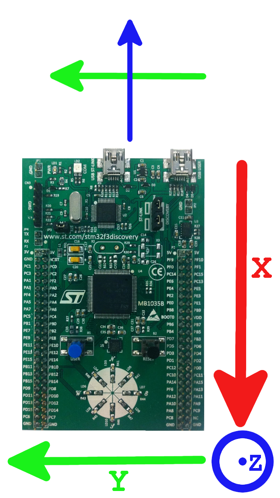

### Requirements
- STM32CubeIDE 1.11.0

### Correct microcontroller position
- Generally, USB ports must be pointed at the windshield

### Microcontroller programm explanation
Basically we read data from gyroscope, that communicating with STM32 processor via SPI and accelerometer via I2C.
We convert data from acceleromenter to pitch and roll. We compare maximum values of car pitch, and get the information about car tilt.

- Gyroscope allows us to detect various potholes on the road
- Via accelerometer we get information how the car is tilted.

Then, we convert this data to some int16 status number, that is sent via USB to the host.

### Status code meanings
The specified bit index must be true
| Bit index | Explanation |
| --- | --- |
| 0 | Car is tilted to the right |
| 1 | Car is tilted to the left |
| 2 | Pit on the left side of the car |
| 3 | Pit on the right side of the car |
| 4 | Pit in front |
| 5 | Car is tilted down |
| 6 | Car is tilted up |
